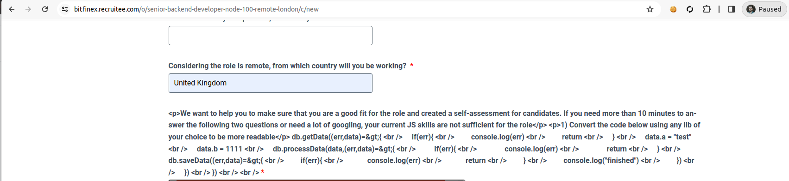

I am assuming that the HTML tags showing on the application form code snippet wsa not intentional?



And instead you are asking me to refactor the following:

```
db.getData((err, data) => {
    if (err) {
        console.log(err)
        return
    }
    data.a = "test"
    data.b = 1111
    db.processData(data, (err, data) => {
        if (err) {
            console.log(err)
            return
        }
        db.saveData((err) => {
            if (err) {
                console.log(err)
                return
            }
            console.log("finished")
        })
    })
})
```


Given the above, there are two possible improved implementations depending on whether the methods/functions on the 'db' instance already return promises.

### If they do return promises

```
    try {
        const data = await db.getData();
        data.a = "test";
        data.b = 1111;

        await db.processData(data);
        await db.saveData();

        console.log("finished");
    } catch (err) {
        console.log(err);
    }

```


### If they do not return promises:

#### First create an Async db wrapper:

```
class AsyncDb {

    db;

    constructor(database){
        this.db = database;
    }

    dbGetData() {
        return new Promise((resolve, reject) => {
            db.getData((err, data) => {
                if (err) {
                    return reject(err);
                }
                resolve(data);
            });
        });
    }

    dbProcessData(data) {
        return new Promise((resolve, reject) => {
            db.processData(data, (err) => {
                if (err) {
                    return reject(err);
                }
                resolve();
            });
        });
    }

    saveData() {
        return new Promise((resolve, reject) => {
            db.saveData((err) => {
                if (err) {
                    return reject(err);
                }
                resolve();
            });
        });
    }
}
```

#### Then utilise wrapper


```
try {
    const asyncDb = new AsyncDb(db);

    const data = await asyncDb.getData();
    data.a = "test";
    data.b = 1111;

    await asyncDb.processData(data);
    await asyncDb.saveData();

    console.log("finished");
} catch (err) {
    console.log(err);
}
```

### Additional thoughts

Depending on exactly what `db.processData` is doing and whether we have control over changing it's implementatoin, the following implementation could be clearer and more intuitive,


```
try {
    const data = await db.getData();
    data.a = "test";
    data.b = 1111;

    const processedData = await db.processData(data);
    await db.saveData(processedData);

    console.log("finished");
} catch (err) {
    console.log(err);
}
```